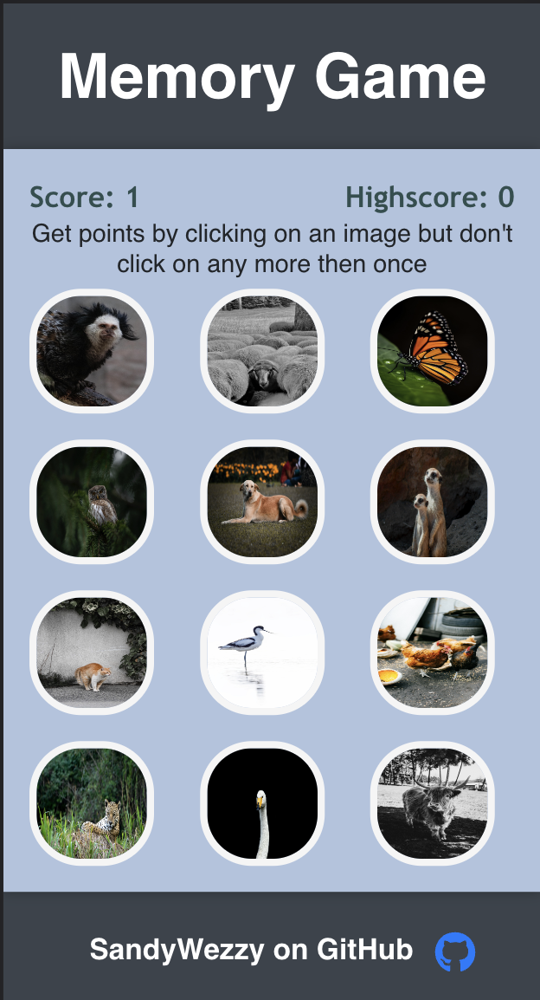

# Memory Card

## This is a singleplayer memory game 

  

    
  

  

    
  

#
## Built With 

- Vanilla JS
- HTML5
- CSS3
- Bootstrap
- React
#

## Live Demo

[Memory Card:]https://SandroCristino.github.io/memory_card/

#

## Rules
In order to win this game you are only allowed to click every picture once
#
## Getting Started

In order to setup and work on this project on your own, you will need to:

1. Clone this project:  
`git clone git@github.com:SandyWezzy/CV_Application.git`

2. Once you have cloned this project, you can install the required dependencies by using:  
`npm install`

3. A live demo of the project can be started by using:  
`npm start`

4. Distribution files can be produced using:  
`npm run build`

#
## 🤝 Contributing

Contributions, issues, and feature requests are welcome!
#
## Show your support

If you got until here, show your love hitting the ⭐️ button, I'd really appreciate it.
